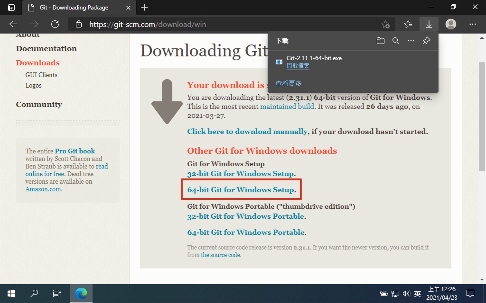
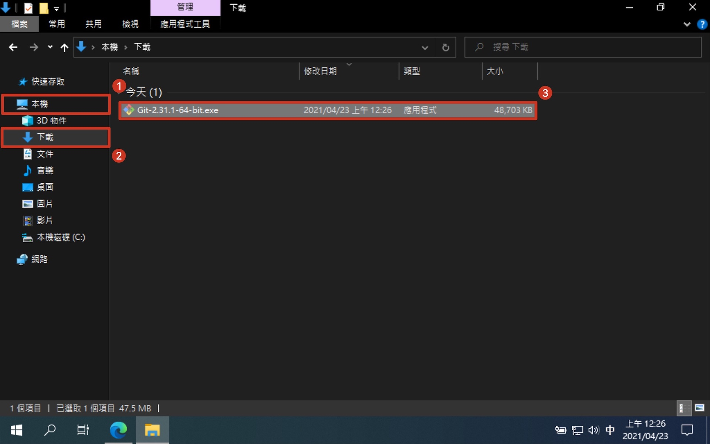
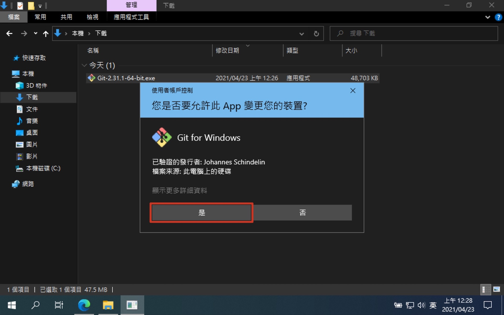
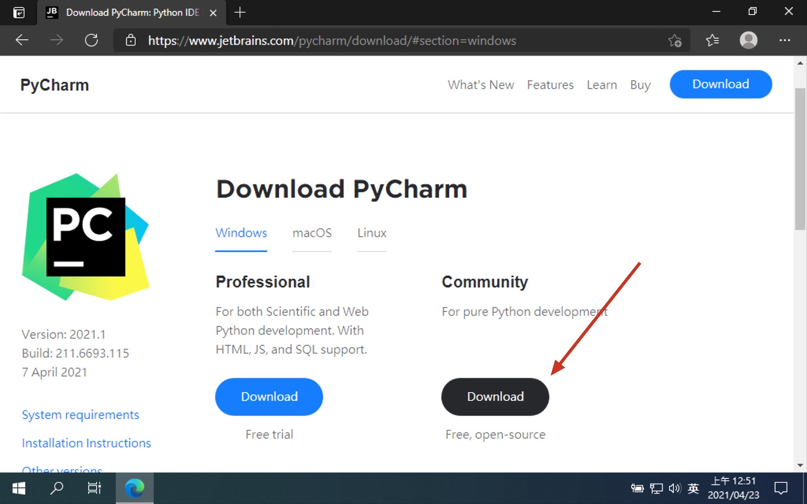
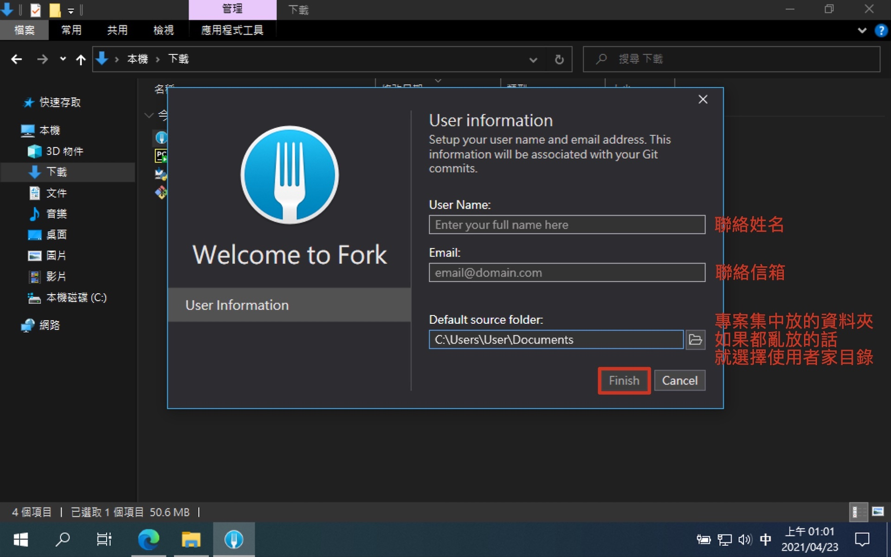
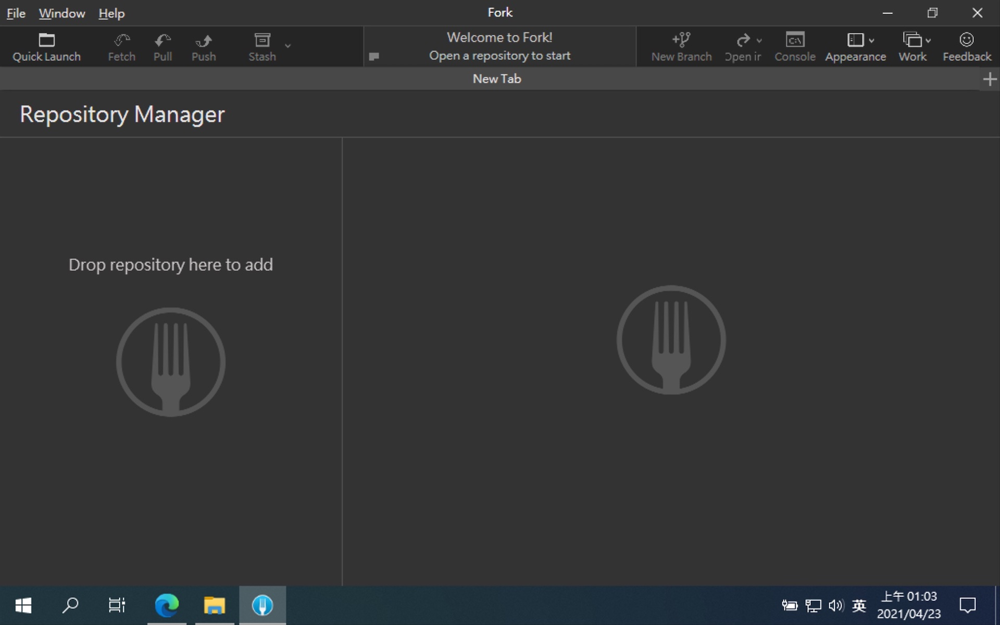

# 第一章：環境建置

## 安裝 Git

- [Git](https://git-scm.com/)

> 版本控制 + Linux CLI (Git Bash)

1. 進入 Git 官網
   
2. 下載 Git 安裝檔
   
3. 開啟下載檔案找到安裝檔
   
4. 授權給 Git 安裝檔
   
5. 安裝步驟直接下一步到底
   
6. Git 安裝完成
   

## 安裝 Python

- [Python](https://www.python.org/)

> 程式語言

1. 進入 Python 官網
   
2. 選取最新版前一版
   
3. 下載 Windows 版的 Python
   
4. 開啟下載檔案找到安裝檔
   
5. 設定並安裝 Python
   
6. 授權給 Python 安裝檔
   
7. Python 安裝完成
   

### 確認 Windows 環境變數

> %USERPROFILE%\AppData\Local\Programs\Python\Python38\

> %USERPROFILE%\AppData\Local\Programs\Python\Python38\Scripts\

1. 開啟 Git Bash
   
2. 確認環境變數
   ```shell
   # 查看環境變數 PATH
   $ echo $PATH
   ```
   

### 確認 Python 安裝成功

> 之後在教程中看到 $ 開頭，代表使用 Git Bash 輸入 $ 以後的指令

```shell
# 確認 Python 安裝成功
$ python --version
Python 3.8.8

# 確認 PIP 安裝成功
$ pip --version
pip 20.2.3 from c:\users\user\appdata\local\programs\python\python38\lib\site-packages\pip (python 3.8)
```

## 安裝 Pipenv

- [Pipenv](https://github.com/pypa/pipenv)

> Python 虛擬環境

```shell
# 安裝 pipenv，--user 只安裝在當前使用者的資料夾
$ pip install --user pipenv

# 設定使用者環境變數：將 Python 的路徑改為當前使用者資料夾下的 Python
$ setx PATH "%PATH%;%USERPROFILE%\AppData\Roaming\Python\Python38\Scripts"
SUCCESS: Specified value was saved.

# 設定使用者環境變數：虛擬環境建立在當前資料夾下
$ setx PIPENV_VENV_IN_PROJECT "true"
SUCCESS: Specified value was saved.

# 要先重啟 Git Bash，環境變數才會生效！！！
# 確認 Pipenv 安裝成功
$ pipenv --version
pipenv, version 2020.11.15
```

## 安裝 Pycharm

- [PyCharm](https://www.jetbrains.com/pycharm/)

> Python IDE (整合開發環境)

1. 進入 PyCharm 官網
   
2. 選擇 PyCharm 社群版
   
3. 開啟下載檔案找到安裝檔
   
4. 授權給 PyCharm 安裝檔
   
5. 安裝步驟直接下一步到底
   
6. PyCharm 安裝完成
   

## 安裝 Fork

- [Fork](https://git-fork.com/)

> Git 圖形化介面

1. 進入 Fork 官網下載安裝檔
   
2. 開啟下載檔案找到安裝檔
   
3. 設定並安裝 Fork
   
4. Fork 安裝完成
   
