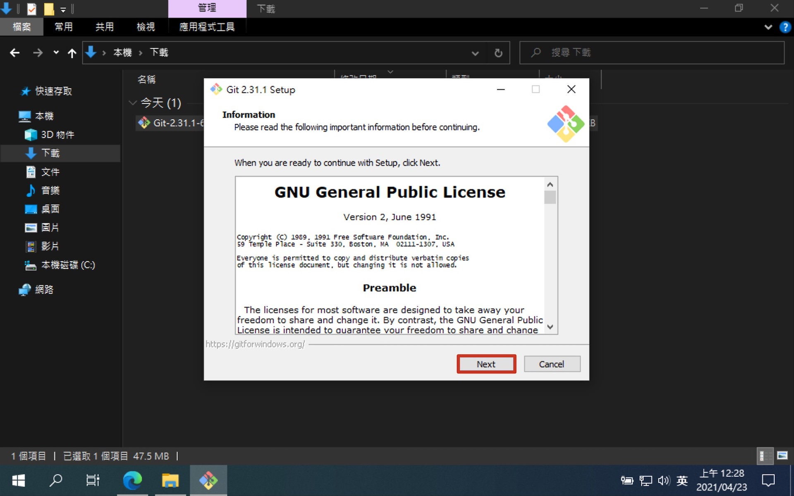
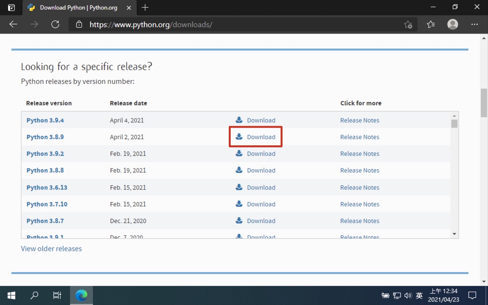
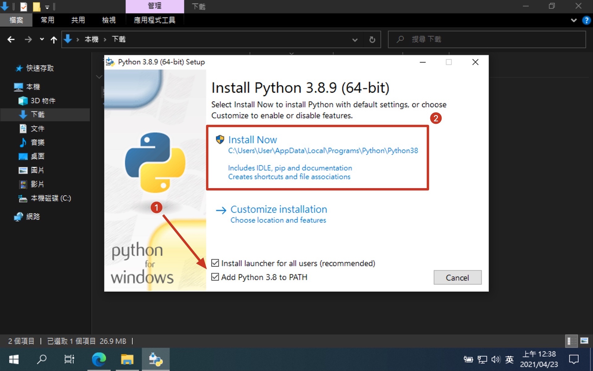
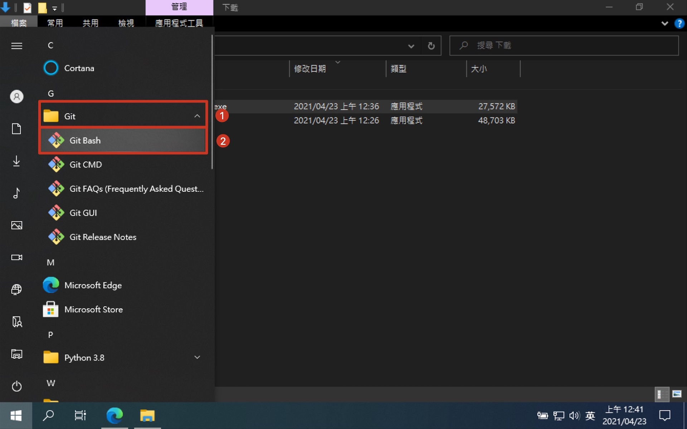
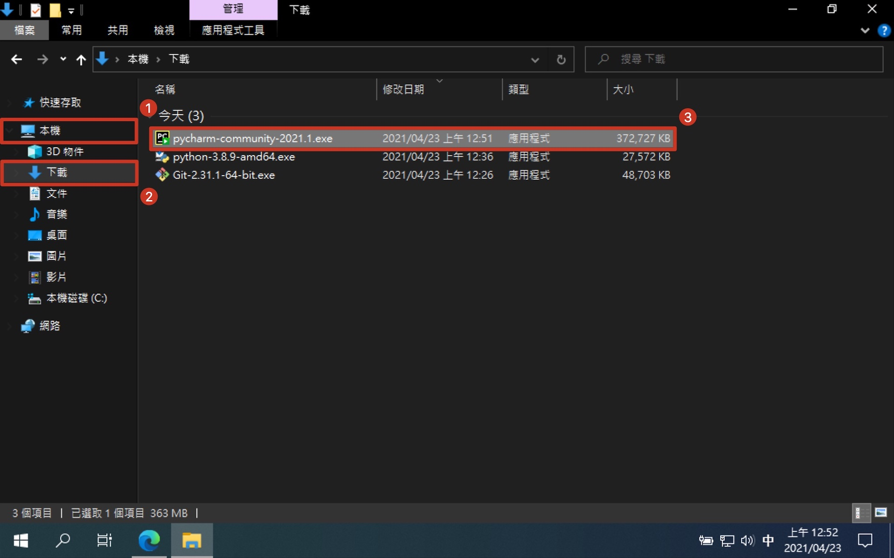
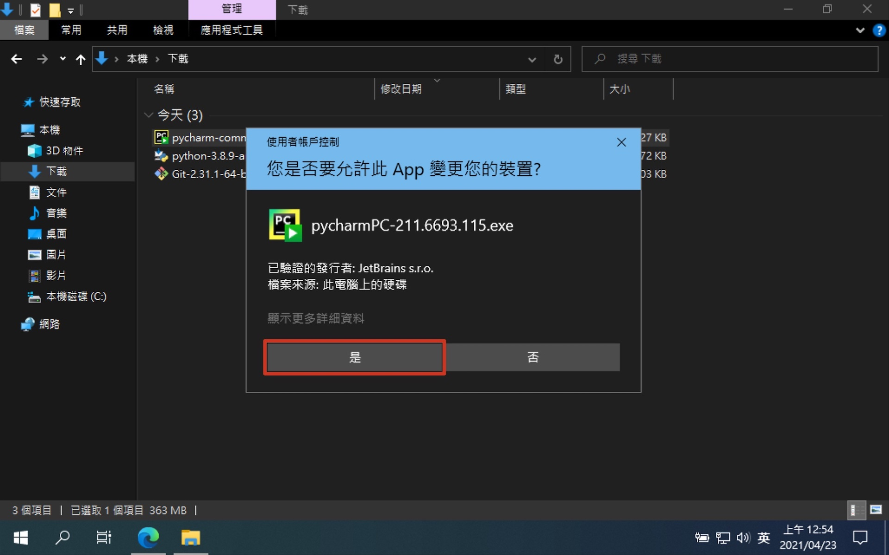
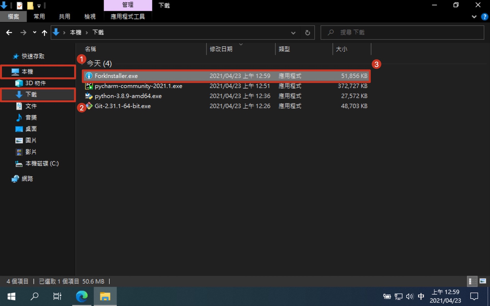

# 第一章：環境建置

我們在開始開發網頁之前，需要先在電腦把需要用到的工具都裝起來，才能順利的進行開發。

## 安裝 Git

- [Git 官方網站](https://git-scm.com/)

Git 是版本控制的工具。版本控制是什麼？又為什麼要用呢？

我們在進行開發時，可能會大量的修改檔案，也許改到一半會想使用一些砍掉的內容，或是改壞了想復原時，也就會想要存取舊的檔案。
那我們需要自己一直複製舊的檔案以備不時之需嗎？又要怎麼儲存才能方便查找？如果每次修改前先複製一份，久了會不會產生龐大的資料？
如果有一群人一起開發時，那又要怎麼確保彼此之間的檔案內容是同步的，以及彼此修改了哪些檔案呢？

這些問題都能透過 Git 來解決，雖然 Git 的指令本身不是那麼好上手，但實際上常用的指令並不是那麼多。
越早開始使用久了就會熟練，並且發現在開發上的益處不可小覷。
我們會在第四章介紹 Git 的基本語法。

它還會附帶一個 Git Bash 的應用程式，它會是一個 Linux 指令的命令列工具。
我們會以它當作主要使用的命令列工具，因為我們教程最後推上的平台使用的是 Linux 作業系統。
如此一來我們能統一使用的語法，並且不用學習兩次。

那下面就來教大家怎麼進行 Git 的安裝。

1. 進入 Git 的官方網站
   
2. 下載 Git 安裝檔
   
3. 開啟下載檔案找到安裝檔
   
4. 授權給 Git 安裝檔
   
5. 安裝步驟直接下一步到底
   
6. Git 安裝完成
   

## 安裝 Python

- [Python 官方網站](https://www.python.org/)

Django 是使用 Python 進行開發的大型網頁框架，因此我們在使用時也需要安裝 Python。
這個教程是假設你已經了解了基本的 Python 語法，我們會解釋 Django 的語法，但我們基本上不會解釋 Python 語法。
我們會使用最新版的前一版，雖然 Django 本身都跟得上最新版的 Python，但大部分的套件都跟不上，所以不推薦使用最新版。
如果是新手，卻已經裝了最新版。建議解除安裝，再跟著教學安裝前一版。

那下面就來教大家怎麼進行 Python 的安裝。

1. 進入 Python 官網
   
2. 選取最新版前一版
   
3. 下載 Windows 版的 Python
   
4. 開啟下載檔案找到安裝檔
   
5. 設定並安裝 Python
   
6. 授權給 Python 安裝檔
   
7. Python 安裝完成
   

### 確認 Windows 環境變數

1. 開啟 Git Bash
   
2. 確認環境變數
   ```shell
   # 印出環境變數 PATH，把冒號取代為換行符號，查找包含 Python 的部分
   $ echo $PATH | tr ':' '\n' | grep Python
   /c/Users/User/AppData/Local/Programs/Python/Python38/Scripts
   /c/Users/User/AppData/Local/Programs/Python/Python38
   ```

### 確認 Python 安裝成功

> 之後在教程中看到 $ 開頭，代表使用 Git Bash 輸入 $ 以後的指令

```shell
# 確認 Python 安裝成功
$ python --version
Python 3.8.9

# 確認 PIP 安裝成功
$ pip --version
pip 20.2.3 from c:\users\user\appdata\local\programs\python\python38\lib\site-packages\pip (python 3.8)
```

## 安裝 Pipenv

- [Pipenv GitHub](https://github.com/pypa/pipenv)

我們之後會透過 Pipenv 進行虛擬環境的建置，Pipenv 是第三方開發的虛擬環境建置工具。
虛擬環境可以確保我們在開發時，即使把環境弄髒弄壞，隨時可以砍掉專案下的虛擬環境進行重建，完全不會影響到系統本身的 Python。
專案之間的套件版本也不會有衝突的問題，新專案可以使用新版，舊專案繼續使用舊版。
並且我們可以確保團隊之間都安裝同樣的套件版本，並且可以持續進行同步。

那下面就來教大家怎麼進行 Pipenv 的安裝。

```shell
# 安裝 pipenv，--user 只安裝在當前使用者的資料夾
$ pip install --user pipenv

# 設定使用者環境變數：將 Python 的路徑改為當前使用者資料夾下的 Python
$ setx PATH "%PATH%;%USERPROFILE%\AppData\Roaming\Python\Python38\Scripts"
SUCCESS: Specified value was saved.

# 設定使用者環境變數：虛擬環境建立在當前資料夾下
$ setx PIPENV_VENV_IN_PROJECT "true"
SUCCESS: Specified value was saved.

# 要先重啟 Git Bash，環境變數才會生效！！！
# 確認 Pipenv 安裝成功
$ pipenv --version
pipenv, version 2020.11.15
```

## 安裝 PyCharm

- [PyCharm 官方網站](https://www.jetbrains.com/pycharm/)

PyCharm 是為 Python 特製的 IDE (整合開發環境)，基本上裝完之後就能使用，不用特別進行設定。
並且提供語法提示、語法色彩辨識等方便進行開發除錯的功能。
PyCharm 本身有分專業版跟社群版，基本上社群版的功能就已經很夠用了，不用用到專業版。

那下面就來教大家怎麼進行 PyCharm 的安裝。

1. 進入 PyCharm 官網
   
2. 選擇 PyCharm 社群版
   
3. 開啟下載檔案找到安裝檔
   
4. 授權給 PyCharm 安裝檔
   
5. 安裝步驟直接下一步到底
   
6. PyCharm 安裝完成
   

## 安裝 Fork

- [Fork 官方網站](https://git-fork.com/)

Fork 是 Git 的圖形化介面軟體，事實上 Fork 不是必要安裝的工具。
但可以大幅降低 Git 的學習曲線，也大幅提升了使用 Git 的方便性。
在解決衝突時，沒有圖形化介面真的是十分可怕又痛苦。

那下面就來教大家怎麼進行 Fork 的安裝。

1. 進入 Fork 官網下載安裝檔
   
2. 開啟下載檔案找到安裝檔
   
3. 設定並安裝 Fork
   
4. Fork 安裝完成
   
