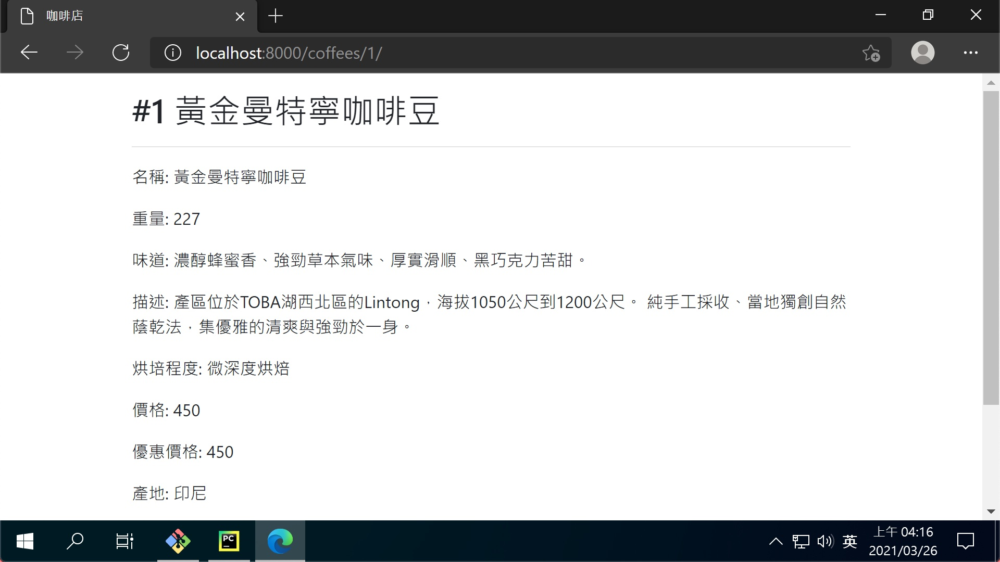

# 第七章：建立細項頁面

## coffees/views.py

> 定義細項頁面的處理函式

```pyyhon
from django.shortcuts import render, get_object_or_404

from .models import Coffee


# Create your views here.
def index(request):
    ...


def show(request, pk):
    coffee = get_object_or_404(Coffee, pk=pk)
    return render(request, 'coffees/show.html', {'coffee': coffee})
```

## coffees/urls.py

> url 為 '/coffees/{pk}/' 時，使用 show 函式進行處理

```python
from django.urls import path

from . import views

app_name = 'coffees'
urlpatterns = [
    # ex: /coffees/
    path('', views.index, name='index'),
    # ex: /coffees/1/
    path('<int:pk>/', views.show, name='show'),
]
```

## templates/coffees/show.html

> 細項頁面自有的 HTML 架構

```html



<h2>#{{ coffee.id }} {{ coffee.name }}</h2>
<hr>
<p>名稱: {{ coffee.name }}</p>
<p>重量: {{ coffee.weight }}</p>
<p>味道: {{ coffee.taste }}</p>
<p>描述: {{ coffee.description }}</p>
<p>烘培程度: {{ coffee.get_roast_display }}</p>
<p>價格: {{ coffee.price }}</p>
<p>優惠價格: {{ coffee.discount }}</p>
<p>產地: {{ coffee.origin_place }}</p>
<p>主要處理法: {{ coffee.main_processing }}</p>
<p>磨豆方式: {{ coffee.grindings.all | join:', ' }}</p>

<a href="" class="btn btn-primary"><< 返回</a>

```

## templates/coffees/index.html

> 在列表頁面添加導向細項的連結

```html
...
<!-- 原本是 <td>{{ coffee.name }}</td> -->
<td>
    <a href="">
        {{ coffee.name }}
    </a>
</td>
...
```

## 成果

- [細項頁面](http://localhost:8000/coffees/1/)


