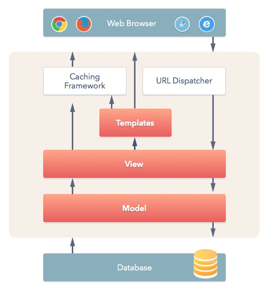

# 第三章：建立第一個 Django App

## 建立 Django App

那我們要開始撰寫屬於我們自己的程式碼了。
Django 希望我們把每個功能分成各個模組，並將其稱之為 App，希望我們能夠把各個功能分離並且能夠重用。

比如我今天要寫一個購物的網站的話，可能會有使用者、產品跟訂單的App。
並且使用者會在產品跟訂單 App 中重複使用，像是產品的建立者跟訂單的購買者。

建立一個新的 App 跟建立核心檔案一樣，我們可以使用 manage.py 去執行 startapp，Django 就會幫我們產生一個新的 App 了。

```shell
# 切換到專案資料夾下 (不在專案資料夾下的話)
$ cd ${path_to_your_project}

# 開啟虛擬環境 (如果還沒開啟的話)
$ pipenv shell

# 建立 coffees app
$ python manage.py startapp coffees
```

### 建立 APP 後的專案架構



上圖是 Django 的架構圖，類似 MVC (Model–View-Controller)，但由命名上來看的話，Django 的應該稱為 MTV (Model–Template–View)。
首先我們會從使用者的瀏覽器 (Web Browser) 收到請求 (Request)。
會透過 urls 導向對應進行處理的 views。
views 在處理的過程中，可能會使用到資料庫的資料，資料庫的資料會透過 models 來定義類型跟格式。
views 處理完資料後，把要顯示的頁面資料帶給 templates 進行渲染，並把動態值替換掉。
最後回傳回應 (Response) 的 HTML 頁面給使用者的瀏覽器進行顯示。

```shell
.
├── Pipfile
├── Pipfile.lock
├── coffees
│   ├── __init__.py
│   ├── admin.py        # 管理者頁面
│   ├── apps.py         # APP 設定檔
│   ├── migrations      # DB 異動檔
│   │   └── __init__.py
│   ├── models.py       # 模型 (類似 MVC 的 Model)
│   ├── tests.py        # 測試檔
│   └── views.py        # 視圖 (類似 MVC 的 Controller)
├── core
│   ├── __init__.py
│   ├── asgi.py
│   ├── settings.py
│   ├── urls.py
│   └── wsgi.py
└── manage.py
```

## 顯示一個咖啡文字的頁面

### [程式碼](https://github.com/billy0402/django-coffee-shop/tree/CH3)


### coffees/views.py

首先在 views 定義一個處理 HTTP 請求的函式，參數的 requests 事實上是使用者傳來的請求內容，可能包含使用者的身份跟要新增的資料等等。
但我們並不會根據使用者傳來的資料進行不同的回應，只是單純回傳一段包含咖啡文字的 HTML 回去。

```python
from django.http import HttpResponse


# Create your views here.
def index(request):
    return HttpResponse('<h1>咖啡</h1>')
```

### core/urls.py

接著在核心資料的 urls 裡面，定義如果收到去掉網域後開頭為 coffees/ 時，導向 coffees.urls 做後續處理。
事實上 coffees 裡面還沒有 urls 這個檔案，我們等下才會補上去。
include 這個函式會去 coffees app 裡面尋找 urls 檔案，再進行 coffees/ 後面的字的配對。

```python
from django.contrib import admin
from django.urls import path, include

urlpatterns = [
    path('coffees/', include('coffees.urls')),
    path('admin/', admin.site.urls),
]
```

### coffees/urls.py (要新增檔案)

接著在 coffees app 補上一個 urls 的檔案來定義子路由。
如果 coffees/ 後面不帶任何文字的話，使用一開始定義的 index 函式來進行後續處理。

1. 新建 Python 檔案
   
2. 檔案命名
   

```python
from django.urls import path

from . import views

urlpatterns = [
    # ex: /coffees/
    path('', views.index),
]
```

### core/settings.py

最後告訴 Django，我們有定義一個新的 app 並且要使用。

```python
INSTALLED_APPS = [
    ...

    'coffees.apps.CoffeesConfig',
]
```

### 進行測試

大功告成！我們可以打開瀏覽器，在網址列輸入 http://127.0.0.1:8000/coffees/ 後，應該會看到兩個字咖啡。
恭喜你完成了屬於自己的第一個頁面慶祝～ 🎉🎉🎉

## [補充] PyCharm 常用快捷鍵

- [Mac](https://resources.jetbrains.com/storage/products/pycharm/docs/PyCharm_ReferenceCard_mac.pdf)
- [Windows and Linux](https://resources.jetbrains.com/storage/products/pycharm/docs/PyCharm_ReferenceCard.pdf)

> Alt + Enter: 快速修正 (要在錯誤上面按，PyCharm 才知道要修正哪裡)

> Ctrl + Alt + L: 自動排版

> Ctrl + Alt + O: import 排序. 移除多餘 import
