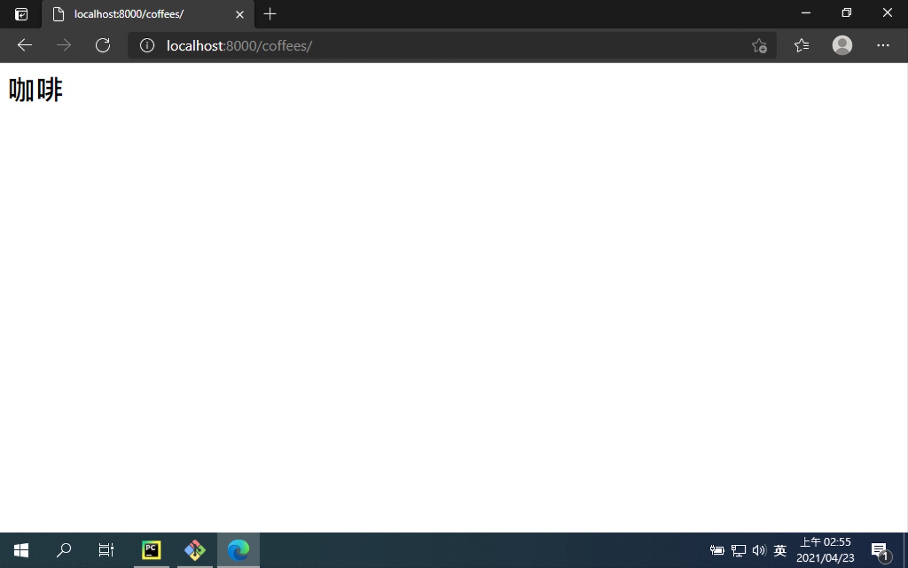
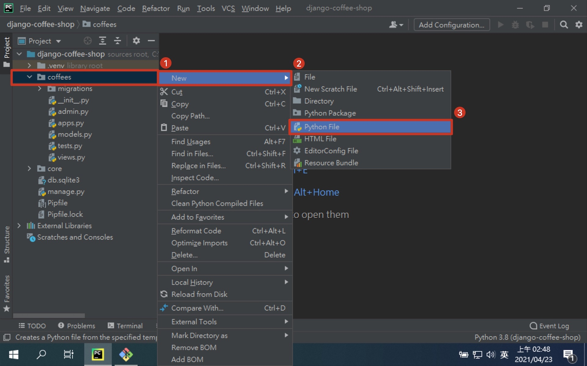
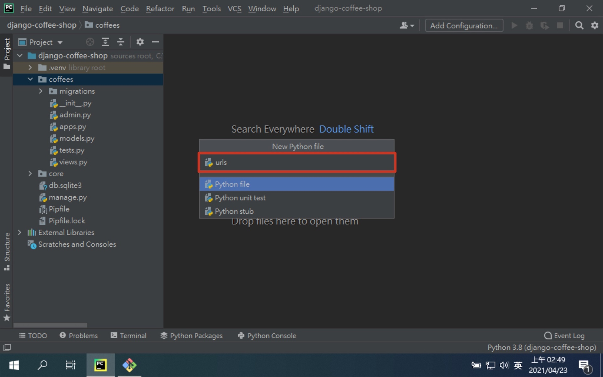

# 第三章：建立第一個 Django App

## 建立 Django App

```shell
# 切換到專案資料夾下 (不在專案資料夾下的話)
$ cd ${path_to_your_project}

# 開啟虛擬環境 (如果還沒開啟的話)
$ pipenv shell

# 建立 coffees app
$ python manage.py startapp coffees
```

### 建立 APP 後的專案架構


```shell
.
├── Pipfile
├── Pipfile.lock
├── coffees
│   ├── __init__.py
│   ├── admin.py        # 管理者頁面
│   ├── apps.py         # APP 設定檔
│   ├── migrations      # DB 異動檔
│   │   └── __init__.py
│   ├── models.py       # 模型 (類似 MVC 的 Model)
│   ├── tests.py        # 測試檔
│   └── views.py        # 視圖 (類似 MVC 的 Controller)
├── core
│   ├── __init__.py
│   ├── asgi.py
│   ├── settings.py
│   ├── urls.py
│   └── wsgi.py
└── manage.py
```

## 目標

### [程式碼](https://github.com/billy0402/django-coffee-shop/tree/CH3)



### coffees/views.py

> 定義一個處理 HTTP 請求的函式，回傳一段 HTML 文字回去

```python
from django.http import HttpResponse


# Create your views here.
def index(request):
    return HttpResponse('<h1>咖啡</h1>')
```

### coffees/urls.py (要新增檔案)

> 新增 coffees app 的路由，不帶任何文字的話使用 index

1. 新建 Python 檔案
   
2. 檔案命名
   

```python
from django.urls import path

from . import views

urlpatterns = [
    # ex: /coffees/
    path('', views.index),
]
```

### core/urls.py

> 收到開頭為 coffees/ 時，導向 coffees.urls 做後續處理

```python
from django.contrib import admin
from django.urls import path, include

urlpatterns = [
    path('coffees/', include('coffees.urls')),
    path('admin/', admin.site.urls),
]
```

### core/settings.py

> 告訴 Django，我們有定義一個新的 app 並且要使用

```python
INSTALLED_APPS = [
    ...

    'coffees.apps.CoffeesConfig',
]
```

### 進行測試

> 打開瀏覽器，輸入 http://127.0.0.1:8000/coffees/

## [補充] PyCharm 常用快捷鍵

- [Mac](https://resources.jetbrains.com/storage/products/pycharm/docs/PyCharm_ReferenceCard_mac.pdf)
- [Windows and Linux](https://resources.jetbrains.com/storage/products/pycharm/docs/PyCharm_ReferenceCard.pdf)

> Alt + Enter: 快速修正 (要在錯誤上面按，PyCharm 才知道要修正哪裡)

> Ctrl + Alt + L: 自動排版

> Ctrl + Alt + O: import 排序. 移除多餘 import
