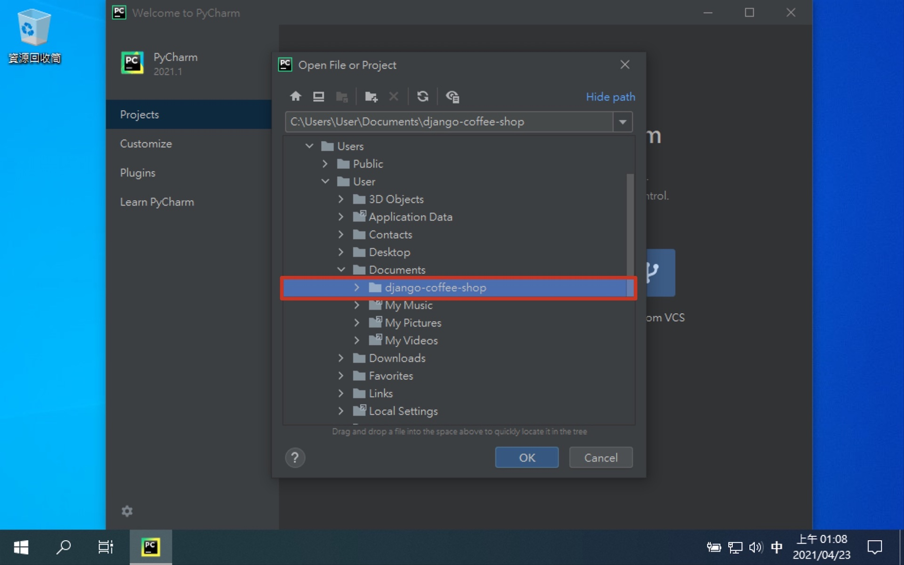
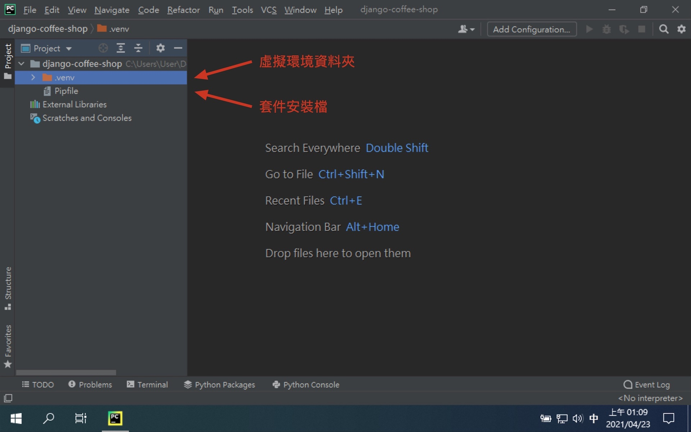
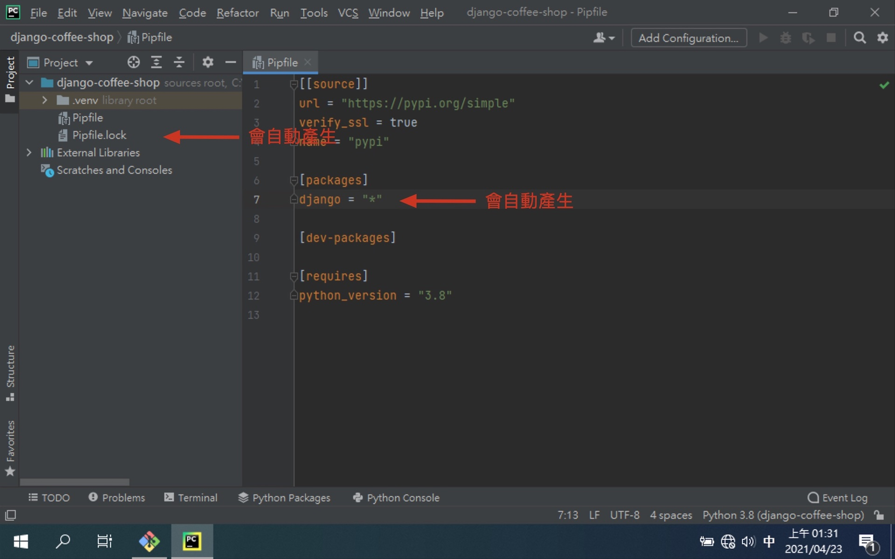
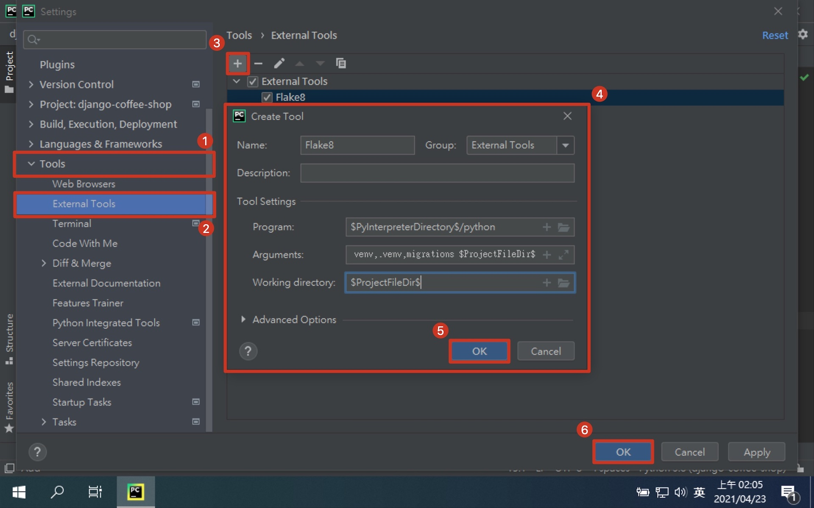

# 第二章：建立 Django 專案

環境已經準備好了，接下來就來建立 Django 專案。
這份教學會一步一步帶大家建置一個咖啡的網站，並且可以對咖啡的資料進行增刪改查。

## 建立專案資料夾

首先要建立一個專案的資料夾，開啟 Git Bash 後，輸入下面的指令，並請自行取個符合專案內容的名字。

```shell
# 切換到 "文件" 資料夾
$ cd Documents

# 建立專案資料夾
$ mkdir ${your_project_name}

# 切換到專案資料夾
$ cd ${your_project_name}
```

## 建立虛擬環境

接下來要為我們的專案建立獨立的虛擬環境，方便我們跟系統本身及其他專案的 Python 環境進行隔離。

> ⚠️ 要切換到專案資料夾底下！！！

> ⚠️ 如果 使用者家目錄 或 文件資料夾 等相對於專案資料夾的上層資料夾下，已經有 Pipfile 或 Pipfile.lock 的話，請先行手動刪除，否則會造成 Pipenv 虛擬環境建錯地方。

```shell
# 建立虛擬環境
$ pipenv --python 3.8
Successfully created virtual environment!
Virtualenv location: C:\Users\User\Documents\${your_project_name}\.venv
Creating a Pipfile for this project...

# 移除虛擬環境 (建錯地方的話)
$ pipenv --rm
Removing virtualenv (C:\Users\User\Documents\${your_project_name}\.venv)...
[=   ] Running...

# 開啟虛擬環境
$ pipenv shell
Launching subshell in virtual environment...

# 確認使用虛擬環境的 Python
$ which python
/c/Users/User/Documents/${your_project_name}/.venv/Scripts/python

# 關閉虛擬環境
# (關閉 Git Bash 前最好先關閉，不然關閉 Git Bash 時，會問你有程式正在執行中)
$ exit
```

## 用 Pycharm 開啟專案

我們可以使用 Pycharm 來開啟專案，並且觀察目前專案資料夾下有哪些檔案產生。
應該只會有兩個資料夾，都是透過 Pipenv 自動產生的。

1. 開啟 PyCharm
   
2. 安裝步驟直接下一步到底
   
3. 選擇開啟專案
   
4. 找到專案位置
   
5. 專案目前狀態
   

## 設定 Pycharm Python 專案直譯器

Pycharm 也許會自己抓到虛擬環境的 Python 直譯器，或是抓錯成系統的 Python 直譯器。
如果沒抓到或是抓錯都不是我們想要的結果，所以我們要告訴 Pycharm 我們的專案直譯器正確位置放在哪裡。
這樣 Pycharm 就會使用正確的 Python 直譯器做正確的語法檢查跟顏色渲染。

1. 開啟 PyCharm 設定
   
2. 更換Python直譯器
   
3. 新增 Python 直譯器
   
4. 選擇已建立的虛擬環境中的 Python
   
5. 直譯器設定完成
   

## 安裝 Django

我們再次開啟 Git Bash，透過 Pipenv 來安裝 Django 套件。

```shell
# 切換到專案資料夾下 (不在專案資料夾下的話)
$ cd ${path_to_your_project}

# 開啟虛擬環境 (如果還沒開啟的話)
$ pipenv shell

# 安裝 Django 套件
$ pipenv install django
```



## 建立 Django 專案

我們接下來要透過 Django 自動產生核心資料夾，通常我們會取為 core。

```shell
# 建立 Django 專案
# 注意最後那個點，core 才會建在當前資料夾，沒加的話，會建立兩層資料夾
$ django-admin startproject core .
```

### 專案核心架構

core 資料夾中，會包含幾個核心檔案，我們之後主要會動到的只有其中兩個。
一個是調整整體專案設定的 settings.py，以及配置網站 url 導向的 urls.py。

```shell
.
├── Pipfile          # 虛擬環境安裝設定檔
├── Pipfile.lock     # 虛擬環境安裝設定檔
├── core             # Django 核心資料夾
│   ├── __init__.py  # 將目錄設為 Python 模組
│   ├── asgi.py      # ASGI 設定檔
│   ├── settings.py  # Django 設定檔
│   ├── urls.py      # 網站路由設定檔
│   └── wsgi.py      # WSGI 設定檔
└── manage.py        # Django 指令程式
```

## 執行開發用伺服器

我們可以透過 manage.py 執行 Django 的各種指令。
runserver 會執行 Django 開發用的伺服器，會預設使用 8000 埠號。
我們可以開啟瀏覽器，在網址列輸入 http://127.0.0.1:8000/， 應該會看到 Django 初始化的歡迎頁面。

```shell
$ python manage.py runserver
Watching for file changes with StatReloader

# 用瀏覽器開啟 http://127.0.0.1:8000/
```

- [預設本地伺服器](http://127.0.0.1:8000/)


## [補充] 安裝 Flake8

在團隊開發的過程中，彼此之間寫程式的習慣一定會有所不同。
Python 有定義出希望大家能遵守的排版風格叫做 PEP 8。
這基本上不是強迫的，只要語法對程式肯定還是會正常執行，但大家光是看到彼此不一樣的排版可能會很痛苦。
Flake8 是第三方的排版檢查工具之一，執行後會告訴你哪邊沒排好，能讓大家的排版方式盡可能的一致。

- [Flake8](https://flake8.pycqa.org/en/latest/)
- [PEP 8 -- Style Guide for Python Code](https://www.python.org/dev/peps/pep-0008/)

```shell
# 安裝 flake8
$ pipenv install --dev flake8 flake8-commas

# 排版檢查指令，--exclude 排除虛擬環境. 資料庫異動檔
$ flake8 --show-source --statistics --exclude venv,.venv,migrations .
```

### 設定 Pycharm Flake8 快捷鍵

因為排版檢查是很常進行的動作，所以設定快捷鍵會很方便。按久還能成為習慣動作，也能讓大家更願意進行排版檢查的動作。 

1. 開啟 PyCharm 設定
   
2. 設定 Flake8 External Tools
   > Program: $PyInterpreterDirectory$/python

   > Arguments: -m flake8 --show-source --statistics --exclude venv,.venv,migrations $ProjectFileDir$

   > Working directory: $ProjectFileDir$

   
3. 設定 Flake8 快捷鍵
   
