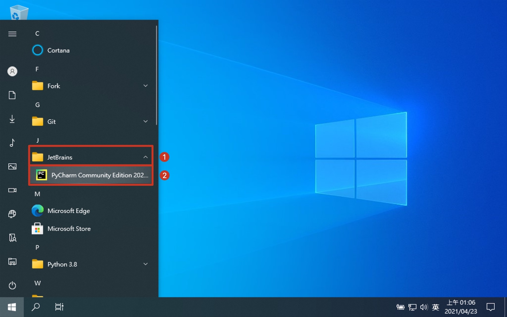
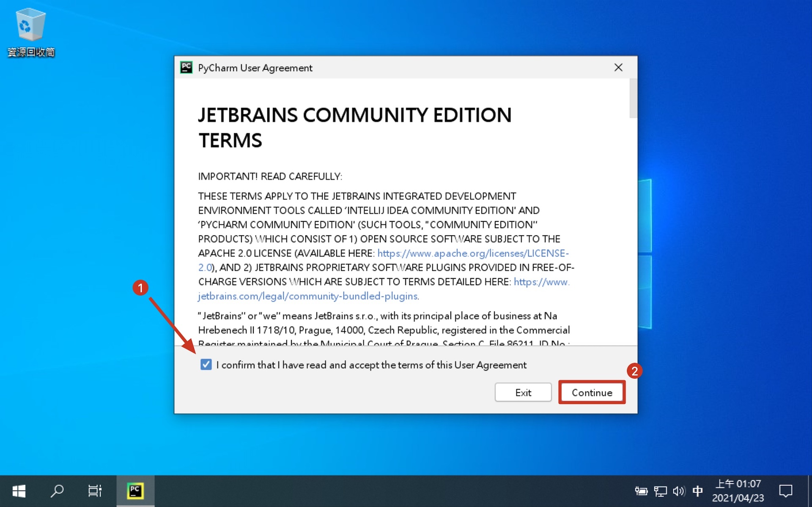
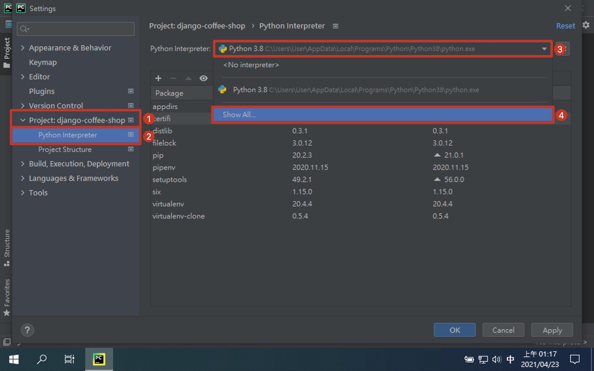
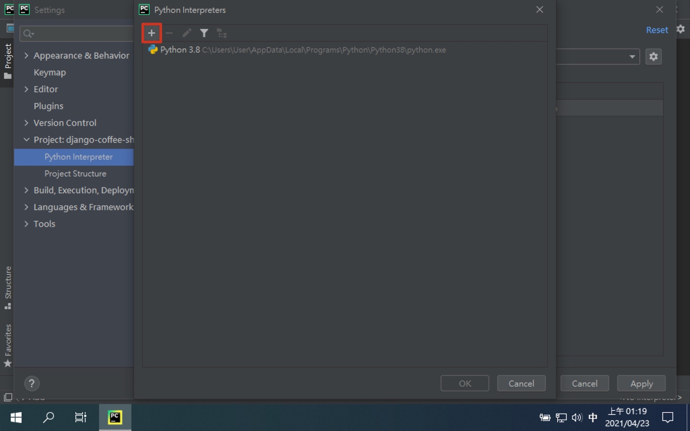
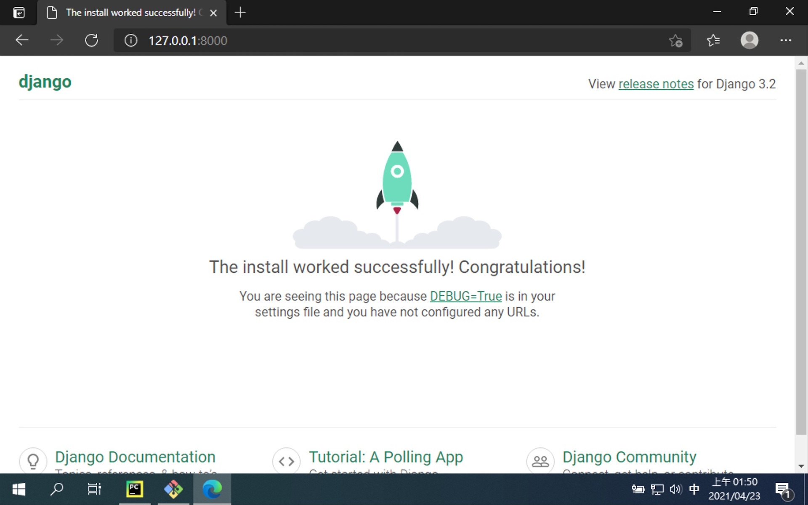
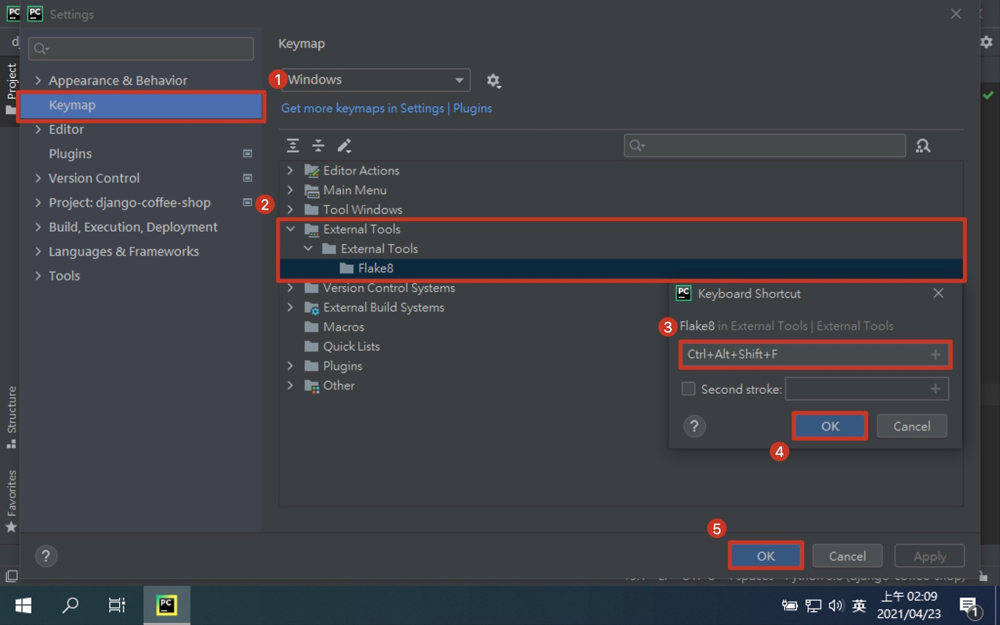

# 第二章：建立 Django 專案

## 建立專案資料夾

```shell
# 切換到 "文件" 資料夾
$ cd Documents

# 建立專案資料夾
$ mkdir ${your_project_name}

# 切換到專案資料夾
$ cd ${your_project_name}
```

## 建立虛擬環境

> ⚠️ 要切換到專案資料夾底下！！！

> ⚠️ 如果 使用者家目錄 或 文件資料夾 等相對於專案資料夾的上層資料夾下，已經有 Pipfile 或 Pipfile.lock 的話，請先行手動刪除，否則會造成 Pipenv 虛擬環境建錯地方

```shell
# 建立虛擬環境
$ pipenv --python 3.8
Successfully created virtual environment!
Virtualenv location: C:\Users\User\Documents\${your_project_name}\.venv
Creating a Pipfile for this project...

# 移除虛擬環境 (建錯地方的話)
$ pipenv --rm
Removing virtualenv (C:\Users\User\Documents\${your_project_name}\.venv)...
[==  ] Running...

# 開啟虛擬環境
$ pipenv shell
Launching subshell in virtual environment...

# 確認使用虛擬環境的 Python
$ which python
/c/Users/User/Documents/${your_project_name}/.venv/Scripts/python

# 關閉虛擬環境
# (關閉 Git Bash 前最好先關閉，不然關閉 Git Bash 時，會問你有程式正在執行中)
$ exit
```

## 用 Pycharm 開啟專案

1. 開啟 PyCharm
   
2. 安裝步驟直接下一步到底
   
3. 選擇開啟專案
   
4. 找到專案位置
   
5. 專案目前狀態
   

## 設定 Pycharm Python 專案直譯器

1. 開啟 PyCharm 設定
   
2. 更換Python直譯器
   
3. 新增 Python 直譯器
   
4. 選擇已建立的虛擬環境中的 Python
   
5. 直譯器設定完成
   

## 安裝 Django

```shell
# 切換到專案資料夾下 (不在專案資料夾下的話)
$ cd ${path_to_your_project}

# 開啟虛擬環境 (如果還沒開啟的話)
$ pipenv shell

# 安裝 Django 套件
$ pipenv install django
```


## 建立 Django 專案

```shell
# 建立 Django 專案
$ django-admin startproject core .
```

### 專案核心架構

```shell
.
├── Pipfile          # 虛擬環境安裝設定檔
├── Pipfile.lock     # 虛擬環境安裝設定檔
├── core             # Django 核心資料夾
│   ├── __init__.py  # 將目錄設為 Python 模組
│   ├── asgi.py      # ASGI 設定檔
│   ├── settings.py  # Django 設定檔
│   ├── urls.py      # 網站路由設定檔
│   └── wsgi.py      # WSGI 設定檔
├── db.sqlite3       # 檔案型資料庫
└── manage.py        # Django 指令程式
```

## 執行開發用伺服器

```shell
$ python manage.py runserver
Watching for file changes with StatReloader

# 用瀏覽器開啟 http://127.0.0.1:8000/
```

- [預設本地伺服器](http://127.0.0.1:8000/)



## [補充] 安裝 Flake8

- [Flake8](https://flake8.pycqa.org/en/latest/)
- [PEP 8 -- Style Guide for Python Code](https://www.python.org/dev/peps/pep-0008/)

> 程式碼排版

```shell
# 安裝 flake8
$ pipenv install --dev flake8 flake8-commas

# 排版檢查指令，--exclude 排除虛擬環境. 資料庫異動檔
$ flake8 --show-source --statistics --exclude venv,.venv,migrations .
```

### 設定 Pycharm Flake8 快捷鍵

1. 開啟 PyCharm 設定
   
2. 設定 Flake8 External Tools
   > Program: $PyInterpreterDirectory$/python

   > Arguments: -m flake8 --show-source --statistics --exclude venv,.venv,migrations $ProjectFileDir$

   > Working directory: $ProjectFileDir$

   
3. 設定 Flake8 快捷鍵
   
