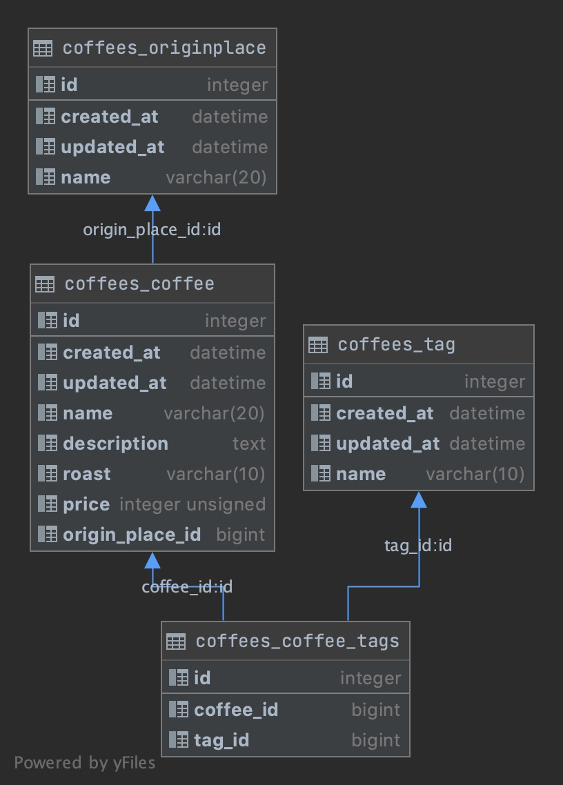

# 第五章：建立資料庫

## 資料庫關聯圖



## coffees/models.py

> 定義資料庫

```python
from django.db import models

from utils.models import TimestampModel


# Create your models here.
class Roast(models.TextChoices):
    # enum = value, display
    LIGHT = 'Light', '極淺度烘焙'
    CINNAMON = 'Cinnamon', '淺度烘焙'
    MEDIUM = 'Medium', '中度烘焙'
    HIGH = 'High', '中度微深烘焙'
    CITY = 'City', '中深度烘焙'
    FULL_CITY = 'Full-City', '微深度烘焙'
    FRENCH = 'French', '極深烘焙'
    ITALIAN = 'Italian', '極深度烘焙'


class OriginPlace(models.Model):
    name = models.CharField('名稱', max_length=20, unique=True)

    def __str__(self):
        return self.name

    class Meta:
        verbose_name = '產地'
        verbose_name_plural = '產地'


class Tag(TimestampModel):
    name = models.CharField('名稱', max_length=10, unique=True)

    def __str__(self):
        return self.name

    class Meta:
        verbose_name = '標籤'
        verbose_name_plural = '標籤'


class Coffee(TimestampModel):
    name = models.CharField('名稱', max_length=20, unique=True)
    description = models.TextField('描述')
    roast = models.CharField('尺寸', max_length=10, choices=Roast.choices)
    price = models.PositiveIntegerField('價格')
    origin_place = models.ForeignKey(
        OriginPlace,
        on_delete=models.PROTECT,
        verbose_name='種類',
    )
    tags = models.ManyToManyField(Tag, verbose_name='標籤')

    def __str__(self):
        return self.name

    class Meta:
        verbose_name = '咖啡豆'
        verbose_name_plural = '咖啡豆'
```

## coffees/admin.py

> 註冊資料表到管理者畫面

```python
from django.contrib import admin

from .models import Coffee, OriginPlace, Tag

# Register your models here.
admin.site.register(Coffee)
admin.site.register(OriginPlace)
admin.site.register(Tag)
```

## coffees/apps.py

> 讓管理者頁面顯示 APP 中文名稱

```python
from django.apps import AppConfig


class CoffeesConfig(AppConfig):
    default_auto_field = 'django.db.models.BigAutoField'
    name = 'coffees'
    verbose_name = '咖啡'
    verbose_name_plural = '咖啡'
```

## core/settings.py

> 語系與時區調整

```python
LANGUAGE_CODE = 'zh-hant'

TIME_ZONE = 'Asia/Taipei'
```

## 建立異動檔

```shell
$ python manage.py makemigrations
```

## 進行異動

```shell
$ python manage.py migrate
```

## 建立管理者帳號

```shell
$ winpty python manage.py createsuperuser
```

## 開啟管理者畫面

- [管理者頁面](http://localhost:8000/admin/)

1. 登入管理者頁面
   
2. 管理者頁面
   

## 安裝 DB Browser for SQLite

- [DB Browser for SQLite](https://sqlitebrowser.org/)

1. 進入 DB Browser for SQLite 官網下載安裝檔
   
2. 下載安裝檔
   
3. 開啟下載檔案找到安裝檔
   
4. 同意使用條款
   
5. 設定安裝到開始功能表
   
6. 安裝完成
   

### 使用 DB Browser for SQLite 查看 db.sqlite

1. 開啟 DB Browser for SQLite
   
2. 開啟專案下的 SQLite
   
3. 切換資料表
   
4. 咖啡資料表畫面
   
