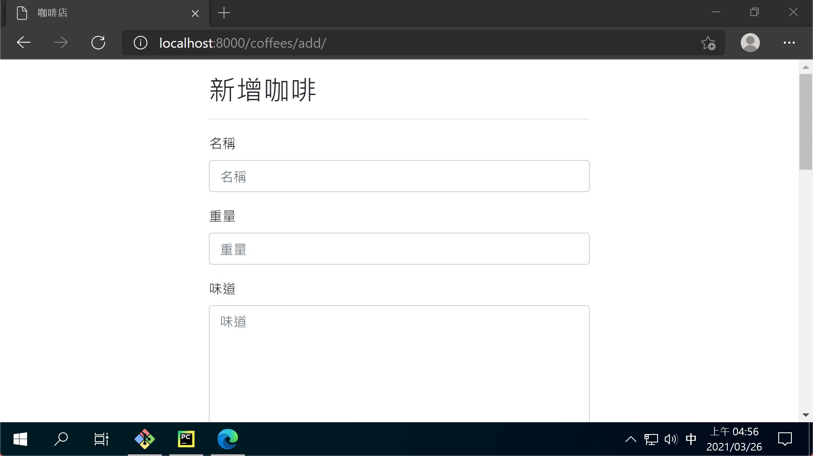

# 第八章：建立新增頁面

## coffees/forms.py

```python
from django import forms

from .models import Coffee


class CoffeeForm(forms.ModelForm):
    class Meta:
        fields = '__all__'
        model = Coffee
```

## coffees/views.py

```python
from django.contrib import messages
from django.shortcuts import render, get_object_or_404, redirect

from .forms import CoffeeForm
from .models import Coffee


# Create your views here.
def index(request):
    ...


def show(request, pk):
    ...


def add(request):
    form = CoffeeForm(request.POST or None)
    if form.is_valid():
        form.save()
        messages.success(request, '新增成功')
        return redirect('coffees:index')
    return render(request, 'coffees/add.html', {'form': form})
```

## coffees/urls.py

```python
from django.urls import path

from . import views

app_name = 'coffees'
urlpatterns = [
    # ex: /coffees/
    path('', views.index, name='index'),
    # ex: /coffees/1/
    path('<int:pk>/', views.show, name='show'),
    # ex: /coffees/add/
    path('add/', views.add, name='add'),
]
```

## templates/share/_form.html

```html


<form action="" method="POST">
    
    
    <button type="submit" class="btn btn-outline-info float-right">送出</button>
</form>
```

## templates/coffees/add.html

```html



<div class="row">
    <div class="col col-sm-10 offset-sm-1 col-md-8 offset-md-2 col-lg-6 offset-lg-3">
        <h2>新增咖啡</h2>
        <hr>
        
    </div>
</div>

```

## templates/coffees/index.html

```html
...
<div class="col">
    <!-- 加上導向新增頁面的連結 -->
    <a href=""
       class="btn btn-outline-info float-right">
        新增咖啡
    </a>
    <h2>咖啡列表</h2>
    ...
```

```html
...
<!-- -->
<div class="row">
    <div class="col">
        <!-- 加上訊息顯示 -->
        

        
    </div>
</div>
...
```

## 成果

- [新增頁面](http://localhost:8000/coffees/add/)


