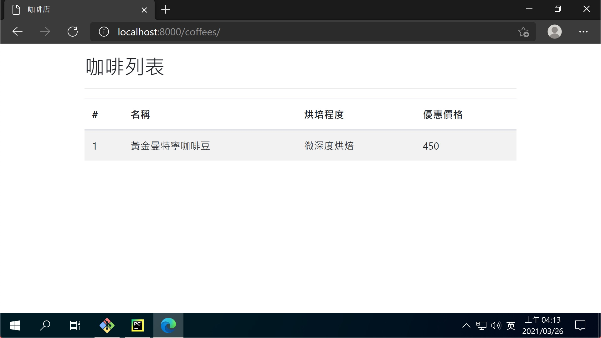

# 第六章：建立列表頁面

## 安裝

- [django-bootstrap 4](https://github.com/zostera/django-bootstrap4)

```shell
$ pipenv install django-bootstrap4
```

## coffees/views.py

> 定義列表頁面的處理函式

```python
from django.shortcuts import render

from .models import Coffee


# Create your views here.
def index(request):
    coffees = Coffee.objects.all()
    return render(request, 'coffees/index.html', {'coffees': coffees})
```

## coffees/urls.py

> url 為 '/coffees/' 時，使用 index 函式進行處理

```python
from django.urls import path

from . import views

app_name = 'coffees'
urlpatterns = [
    # ex: /coffees/
    path('', views.index, name='index'),
]
```

## core/settings.py

> 註冊 django-bootstrap 4，及告訴 Django 模板資料夾位置

```python
INSTALLED_APPS = [
    ...

    'bootstrap4',

    ...
]

TEMPLATES = [
    {
        ...
        'DIRS': [
            BASE_DIR / 'templates',
        ],
        ...
    },
]
```

## templates/layout.html

> 整體共用的 HTML 架構

```html
<!DOCTYPE html>
<html lang="en">

<head>
    <meta charset="UTF-8">
    <meta http-equiv="X-UA-Compatible" content="IE=edge">
    <meta name="viewport" content="width=device-width, initial-scale=1.0">

    <title>咖啡店</title>
    <link rel="stylesheet"
          href="https://cdn.jsdelivr.net/npm/bootstrap@4.6.0/dist/css/bootstrap.min.css"
          integrity="sha384-B0vP5xmATw1+K9KRQjQERJvTumQW0nPEzvF6L/Z6nronJ3oUOFUFpCjEUQouq2+l"
          crossorigin="anonymous">
</head>



<body>
<div class="container my-3">
    <div class="row">
        <div class="col">
            
        </div>
    </div>
</div>
</body>

<script src="https://code.jquery.com/jquery-3.5.1.slim.min.js"
        integrity="sha384-DfXdz2htPH0lsSSs5nCTpuj/zy4C+OGpamoFVy38MVBnE+IbbVYUew+OrCXaRkfj"
        crossorigin="anonymous">
</script>
<script src="https://cdn.jsdelivr.net/npm/bootstrap@4.6.0/dist/js/bootstrap.bundle.min.js"
        integrity="sha384-Piv4xVNRyMGpqkS2by6br4gNJ7DXjqk09RmUpJ8jgGtD7zP9yug3goQfGII0yAns"
        crossorigin="anonymous">
</script>

</html>
```

## templates/coffees/index.html

> 列表頁面自有的 HTML 架構

```html



<div class="row">
    <div class="col">
        <h2>咖啡列表</h2>
        <hr>
        <table class="table table-striped">
            <thead>
            <tr>
                <th>#</th>
                <th>名稱</th>
                <th>烘培程度</th>
                <th>優惠價格</th>
            </tr>
            </thead>
            <tbody>
            
            <tr>
                <td>{{ coffee.id }}</td>
                <td>{{ coffee.name }}</td>
                <td>{{ coffee.get_roast_display }}</td>
                <td>{{ coffee.discount }}</td>
            </tr>
            
            <tr>
                <td class="text-center" colspan="4">沒有咖啡～</td>
            </tr>
            
            </tbody>
        </table>
    </div>
</div>

```

## 成果

- [列表頁面](http://localhost:8000/coffees/)


