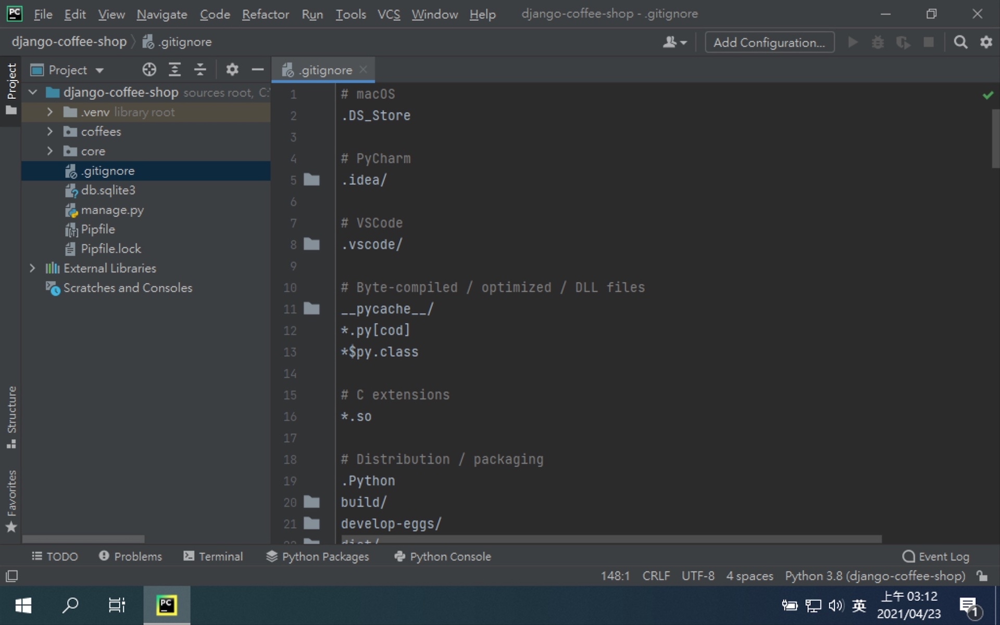
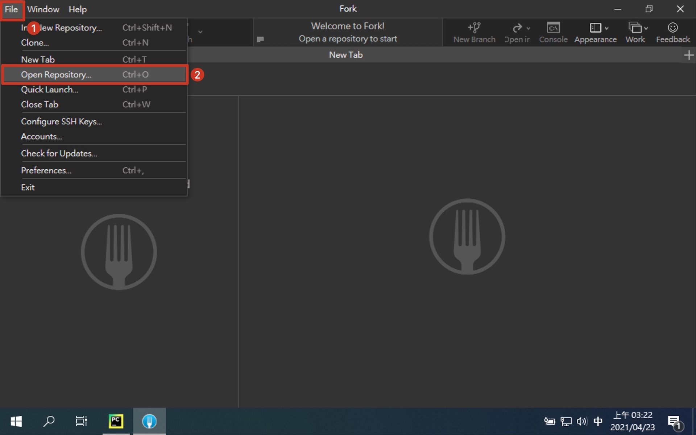
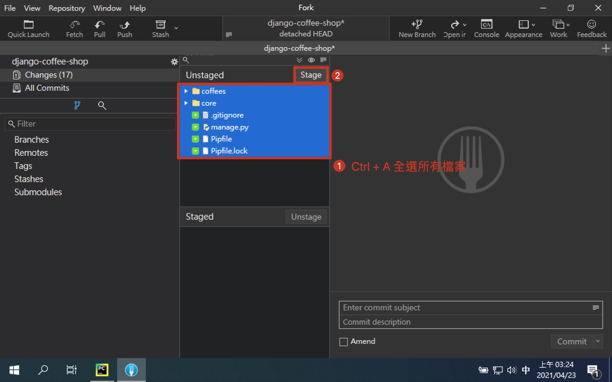
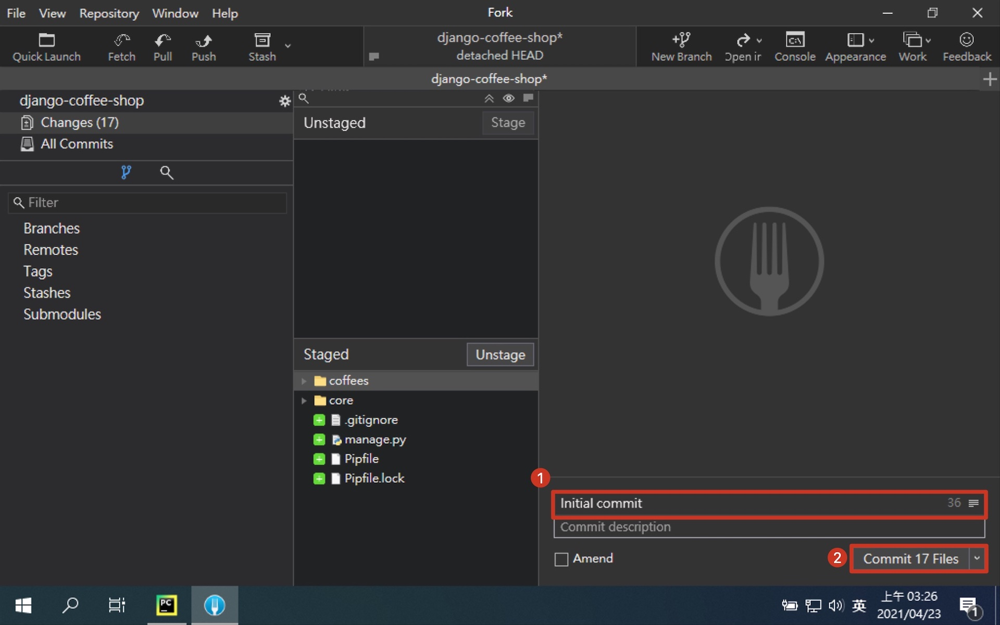
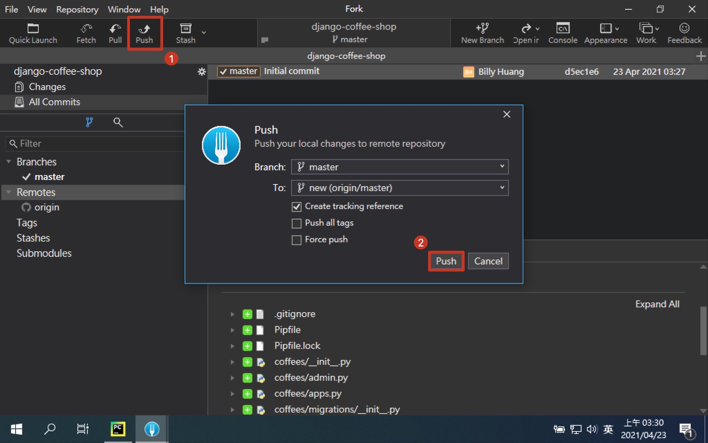

# 第四章：加入版本控制

Git 的用途在第一章就已經提過了，這邊直接開始教大家怎麼把專案推到 GitHub 上面去。

## 在 GitHub 建立 Repository

Git 的遠端儲存庫，除了 GitHub 還有很多家，不過開源專案最大家目前還是非 GitHub 莫屬。
首先我們要建立一個遠端儲存庫，用來存放我們的程式碼，這樣就能隨時隨地存取程式碼，並與團隊的其他人共同進行編輯與維護。

- [GitHub 網站](https://github.com/)

1. 開啟 GitHub
   
2. 註冊 GitHub 帳號
   
3. 登入 GitHub
   
4. 點選建立新的 Repository
   
5. 建立 Repository
   
6. 建立成功畫面
   

## [gitignore](https://github.com/github/gitignore)

我們在開發專案時，必須要排除一些不必要的檔案。
首先一定要排除的是機密資訊，請不要把帳號密碼推到公開的儲存庫，非常危險，可能會使你的系統被攻擊。
再來是虛擬環境跟套件等等，這些隨時可以透過設定檔重建或網路上抓取。
它們不但肥大，而且重複性很高，又也許你永遠想使用最新版的，那又何必把舊版的存著浪費空間呢。
還有其他許多你不想或不應該上傳的檔案都能在 gitignore 定義，讓 Git 自動幫你攔截下來。

GitHub 自己本身有在維護一個 gitignore 專案，裡面定義了各種語言常見的 gitignore 內容。
Python 當然也有，但他沒有幫我們定義會使用哪些 IDE，所以要自己補上 IDE 設定檔的內容。

- [For Python](https://raw.githubusercontent.com/github/gitignore/master/Python.gitignore)

```text
# macOS
.DS_Store

# PyCharm
.idea/

# VSCode
.vscode/
```

### 建立 .gitignore 檔



## 在專案中加入 Git

接下來我們會在專案裡面建立 Git 的內容，最後推上 GitHub 的遠端儲存庫。
這邊會同時展示命令列的指令跟 Fork 的畫面，兩邊的效果是等效的。
我們可以透過 Fork 的畫面，讓你了解到 Git 的指令到底做了什麼事。

- [Git 教學](https://gitbook.tw/)


1. 開啟 Fork


2. 開啟本地專案

```shell
$ cd ${your_project_path}
```



3. 建立 .git 資料夾

```shell
$ git init
```


4. 將所有檔案異動放入暫存區 (Staging Area)

```shell
$ git add .
```



5. 將暫存區的異動提交到本地儲存庫 (Repository)

```shell
$ git commit -m "Initial commit"
```



7. 建立本地分支 master

```shell
$ git branch -M master
```


8. 新增遠端儲存庫節點

```shell
$ git remote add origin ${your_remote_repository_url}
```


9. 將本地的 master 分支 推上 origin 的遠端位置

```shell
# 遠端沒有就建立同名分支，有則更新分支至最新進度
# -u --set-upstream 設定上游 (遠端的預設值)
$ git push -u origin master
```



10. 成功推上 GitHub
   

## [補充] 統一 commit 格式

大家在撰寫 commit 時，一定比程式碼要統一更加困難，不同的語言、文法、符號都不足為奇。
下面推薦一個 commit 格式，除了可以統一以外，還能夠過 commit 了解這次異動是什麼動作，範圍多大。
並且因為會區分動作，無法一次把一大票程式碼胡亂推上來，而失去了 commit 標記辨識的功能。

- [git-cz](https://github.com/streamich/git-cz)

> 格式: <類型>(<範圍>): 修正內容

> 範例: feat(coffees): add index page

### 類型列表

| 類型 | 含義 |
| --- | --- |
| test | 添加缺少的測試 |
| feat | 新增一個功能 |
| fix | 修正一個錯誤 |
| chore | 變更建構流程或輔助工具 |
| docs | 僅修改文件 |
| refactor | 修改程式碼，但沒有新功能也沒有錯誤修正 |
| style | 標記, 空格, 排版, 缺少分號... |
| ci | CI 相關的修改 |
| perf | 修改程式碼，用來提升效能 |
| release | 新增一個發布版的 commit |
