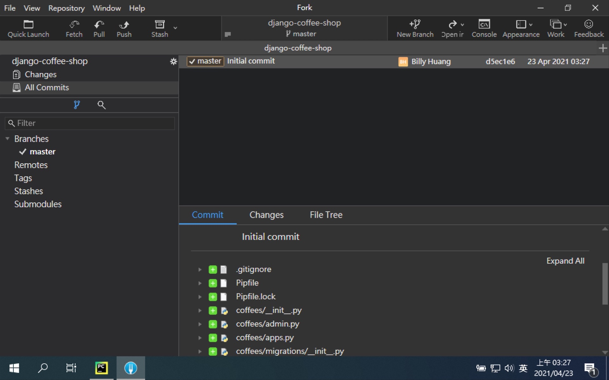
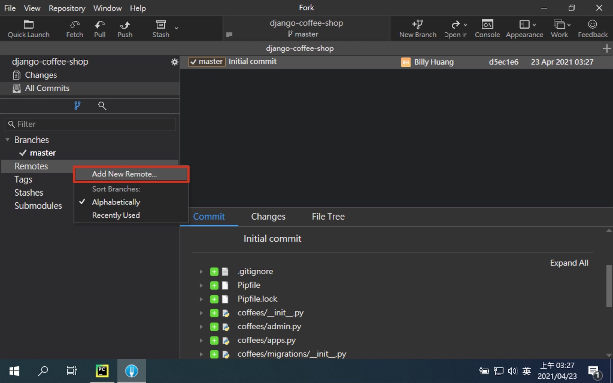
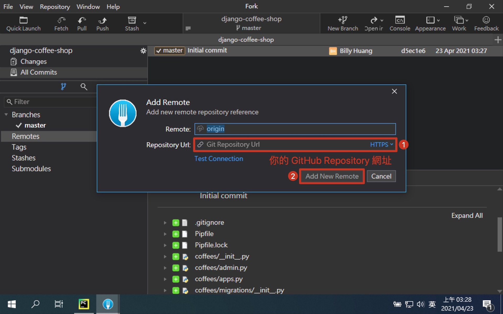

# 第四章：加入版本控制

## 在 GitHub 建立 Repository

- [GitHub](https://github.com/)


1. 開啟 GitHub
   
2. 註冊 GitHub 帳號
   
3. 登入 GitHub
   
4. 點選建立新的 Repository
   
5. 建立 Repository
   
6. 建立成功畫面
   

## [gitignore](https://github.com/github/gitignore)

- [For Python](https://raw.githubusercontent.com/github/gitignore/master/Python.gitignore)

> 排除不必要的檔案

```text
# macOS
.DS_Store

# PyCharm
.idea/

# VSCode
.vscode/
```

### 建立 .gitignore 檔


## 在專案中加入 Git

- [Git 教學](https://gitbook.tw/)


1. 開啟 Fork


2. 開啟本地專案

```shell
$ cd ${your_project_path}
```


3. 建立 .git 資料夾

```shell
$ git init
```


4. 將所有檔案異動放入暫存區 (Staging Area)

```shell
$ git add .
```


5. 將暫存區的異動提交到本地儲存庫 (Repository)

```shell
$ git commit -m "Initial commit"
```


7. 建立本地分支 master

```shell
$ git branch -M master
```



8. 新增遠端儲存庫節點

```shell
$ git remote add origin ${your_remote_repository_url}
```




9. 將本地的 master 分支 推上 origin 的遠端位置

```shell
# 遠端沒有就建立同名分支，有則更新分支至最新進度
# -u --set-upstream 設定上游 (遠端的預設值)
$ git push -u origin master
```


10. 成功推上 GitHub
   

## [補充] 統一 commit 格式

- [git-cz](https://github.com/streamich/git-cz)

> 格式: <類型>(<範圍>): 修正內容

> 範例: feat(coffees): add index page

### 類型列表

| 類型 | 含義 |
| --- | --- |
| test | 添加缺少的測試 |
| feat | 新增一個功能 |
| fix | 修正一個錯誤 |
| chore | 變更建構流程或輔助工具 |
| docs | 僅修改文件 |
| refactor | 修改程式碼，但沒有新功能也沒有錯誤修正 |
| style | 標記, 空格, 排版, 缺少分號... |
| ci | CI 相關的修改 |
| perf | 修改程式碼，用來提升效能 |
| release | 新增一個發布版的 commit |
